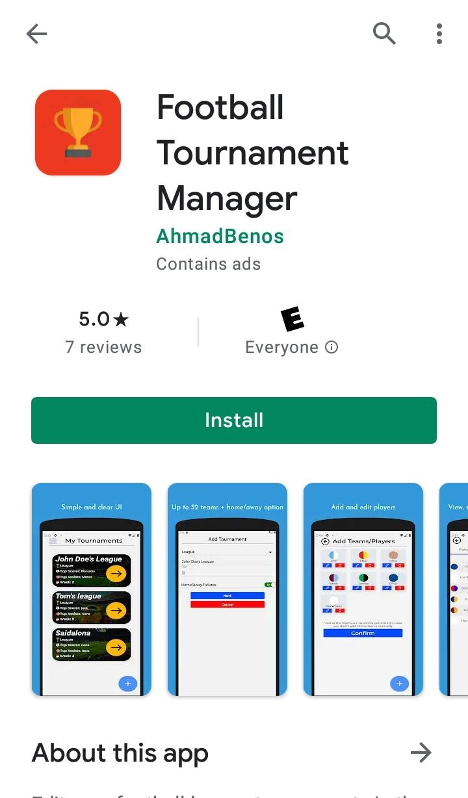

# Playstore link
app is available on the playstore: [https://play.google.com/store/apps/details?id=com.tournament_manager](https://play.google.com/store/apps/details?id=com.tournament_manager)

**If link doesn't work, search for "Ahmadbenos" on the playstore and the app should appear**

**App description is after the screenshots**

## playstore screenshot

 pic 1           |  pic 2          |  pic 3
:-------------------------:|:-------------------------:|:---------------------------
  |    |  

 pic 4           |  pic 5          |  pic 6
:-------------------------:|:-------------------------:|:---------------------------
  |    |  

## App details
App built using react-native(no expo).
Football tournament manager allows users to manage their football league tournaments in a well-organized way with some cool in-app features such as daily voting on real-life football matches.

code details:
 - AWS netlify lambda functions were used in the backend part(daily vote)
 - expo wasn't used therefore i wasn't able to view it on an ios simulator(i have a windows machine). **So,** the app isn't optimized for ios devices.
 - Users' votes are stored on mongoDB in the cloud.
 -  tournament details are stored in the device's local storage(async storage)
 - Didn't work so much on responsiveness but it's fairly compatible to tablets as well.

Features:
 - Clear and simple UI
 - up to 32 teams
 - option to randomize fixtures
 - detailed statistics
 - edit top scorers, top assisters, and most clean sheets
 - view most conceded team and most scored team
 - Nice looking league standings
 - **daily voting on real-life football matches**
 - View how other people are voting in the daily vote

Please reach me out through email if you'd like to view the app code or the serverless function code
